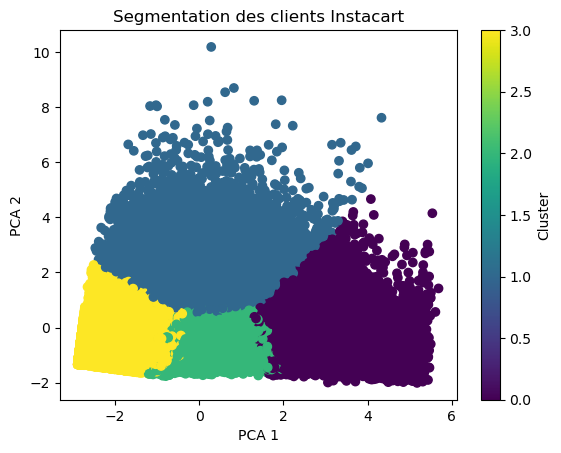

# Instacart Market Analysis



## Description

Ce projet utilise le **dataset Kaggle Instacart Market Analysis** pour explorer et analyser les comportements d'achat des clients d'Instacart. L'objectif est de fournir des insights sur les habitudes d'achat, d'identifier les produits populaires et d'examiner les tendances d'achat des utilisateurs.

### Dataset

Le dataset est disponible sur Kaggle : [Instacart Market Basket Analysis](https://www.kaggle.com/c/instacart-market-basket-analysis).

Le dataset contient plusieurs fichiers CSV :

- `orders.csv`: informations sur les commandes passées par les clients.
- `order_products__prior.csv`: produits commandés par les clients avant la commande actuelle.
- `order_products__train.csv`: produits commandés dans les commandes de test.
- `products.csv`: informations sur les produits.
- `departments.csv`: informations sur les départements de produits.
- `aisles.csv`: informations sur les allées dans le magasin.

---

## Prérequis

Assurez-vous d'avoir Python installé sur votre machine ainsi que les bibliothèques nécessaires pour exécuter ce projet. Vous pouvez créer un environnement virtuel pour faciliter l'installation.

### Installation des dépendances

1. Clonez ce repository sur votre machine locale :

   ```bash
   git clone https://github.com/USERNAME/Instacart-Market-Analysis.git
   cd Instacart-Market-Analysis
